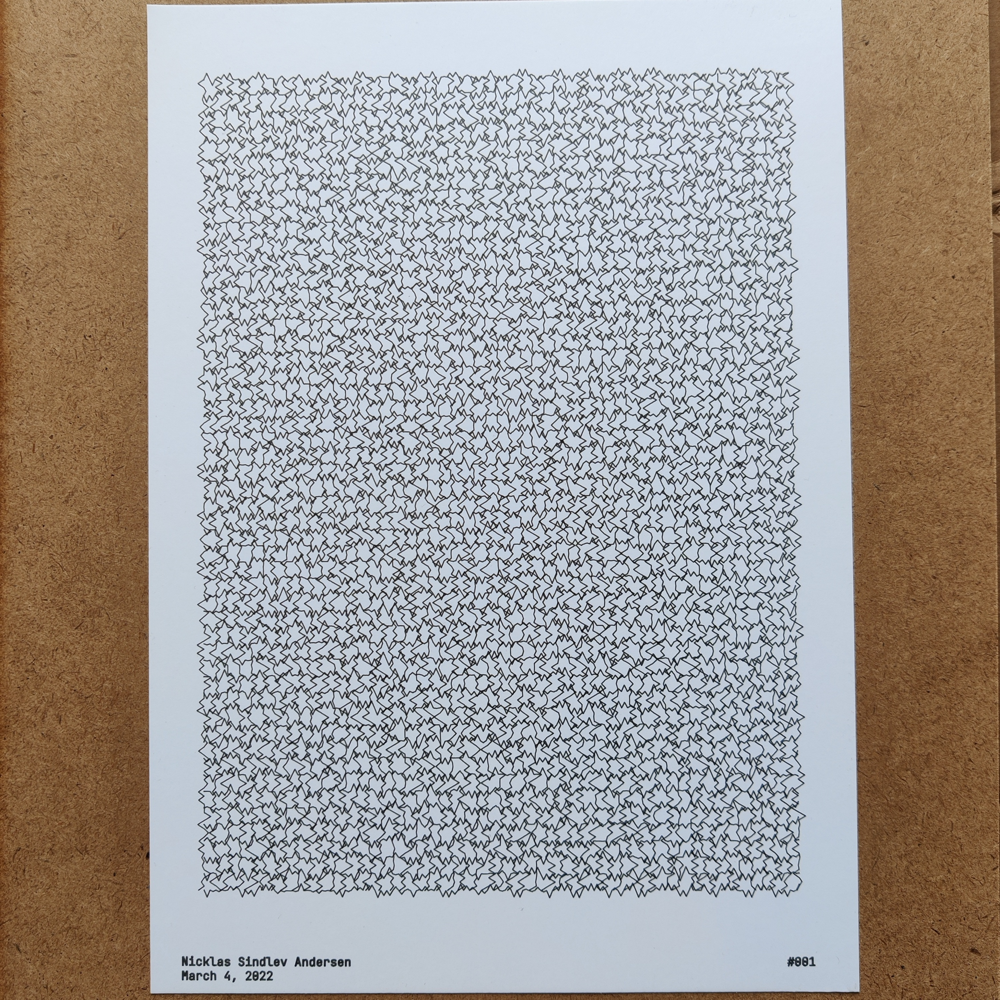
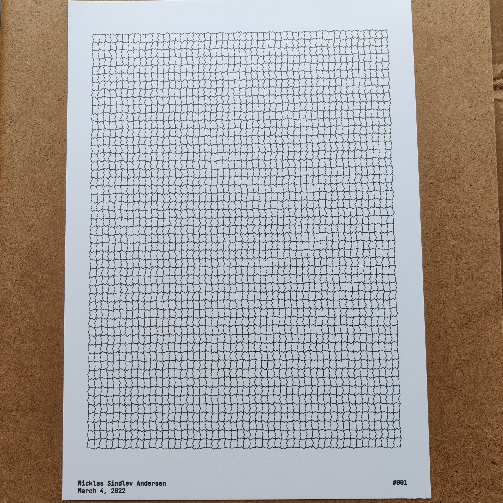

# Sketch001

Sketch001v1                                          |  Sketch001v2                                        |  Sketch001v2                                       |
:---------------------------------------------------:|:---------------------------------------------------:|:--------------------------------------------------:|
  |  | |

#### Short Description

Evenly spaced horizontal and vertical lines. Each horizontal and vertical line consists of points (x, y coordinate pairs). Every other point in a line has been perturbed, in both dimensions, to various degrees by Gaussian noise.

#### Sketch Details

The different versions of the sketch were generated with the following general attributes: 

 Attribute   | Value                                |
:-----------:|:------------------------------------:|
 Format      | A4                                   |
 Line width  | 0.02mm                               |

## Penplotter Output

Sketch001v1                                          |  Sketch001v2                                        |  Sketch001v3                                       |
:---------------------------------------------------:|:---------------------------------------------------:|:--------------------------------------------------:|
  |  | |

#### Drawing Utensils

 

 Type        | Value                                |
:-----------:|:------------------------------------:|
 Paper       | Daler & Rowney, A4, bristol board    |
 Pen         | Staedtler, 0.1mm, fineliner          |

