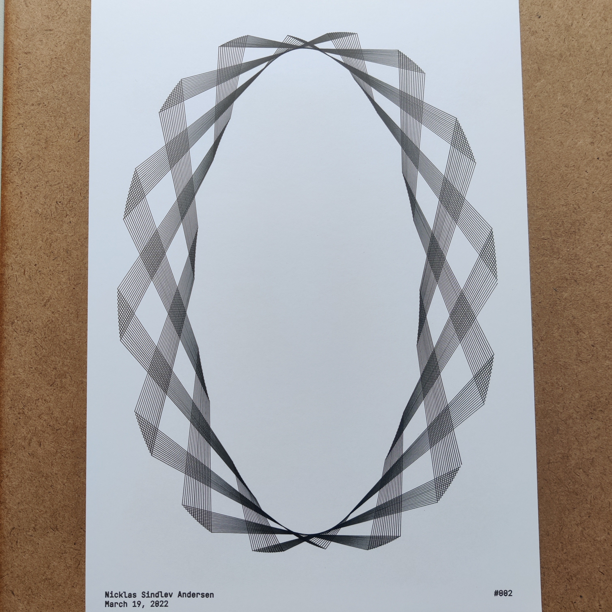
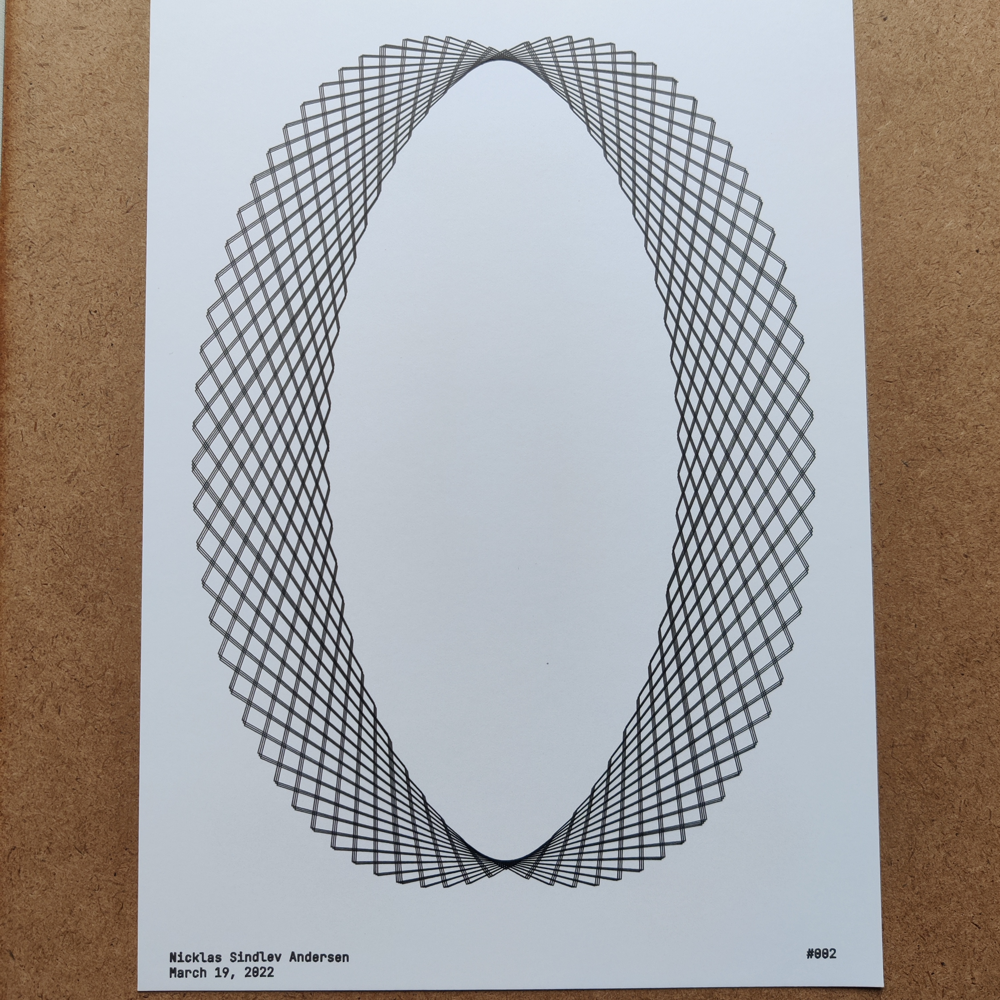
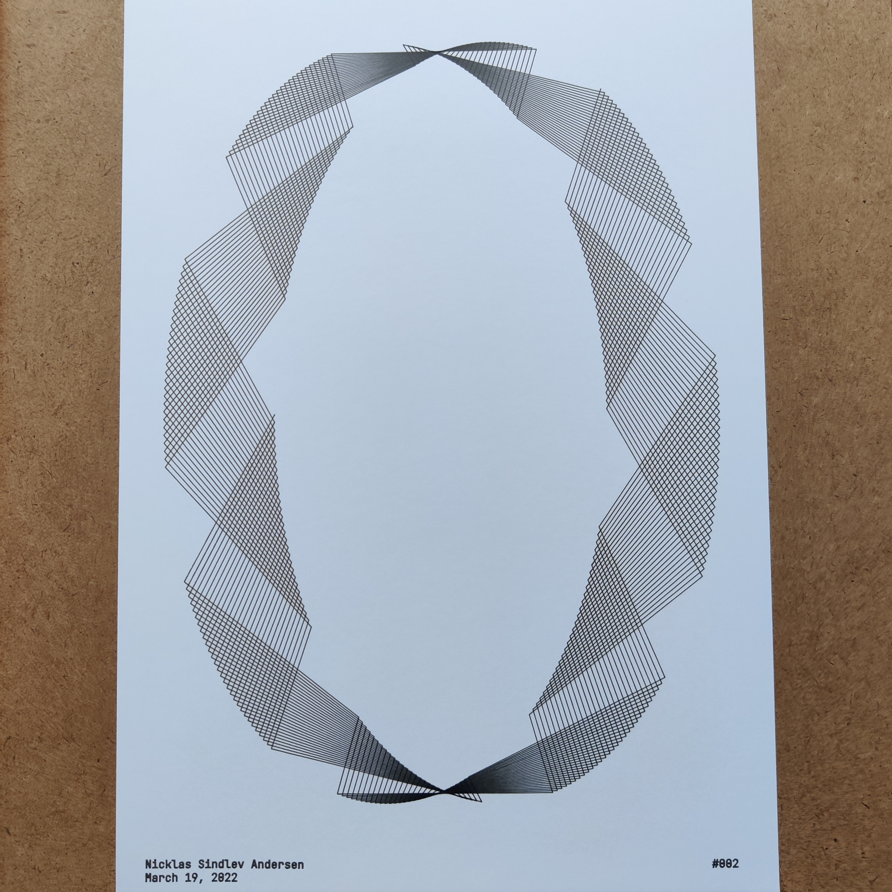

# Sketch002

Sketch002v1                                          |  Sketch002v2                                        |  Sketch002v3                                       |
:---------------------------------------------------:|:---------------------------------------------------:|:--------------------------------------------------:|
  |  | |

#### Short Description

Roulette curves (specifically Epitrochoid and Hypotrochoid curves) whose x and y coordinates have been scaled appropriately to fit the format.

#### Sketch Details

The different versions of the sketch were generated with the following general attributes: 

 Attribute   | Value                                |
:-----------:|:------------------------------------:|
 Format      | A4                                   |
 Line width  | 0.02mm                               |

## Penplotter Output

Sketch002v1                                          |  Sketch002v2                                        |  Sketch002v3                                       |
:---------------------------------------------------:|:---------------------------------------------------:|:--------------------------------------------------:|
  |  | |

#### Drawing Utensils

 

 Type        | Value                                |
:-----------:|:------------------------------------:|
 Paper       | Daler & Rowney, A4, bristol board    |
 Pen         | Staedtler, 0.1mm, fineliner          |

