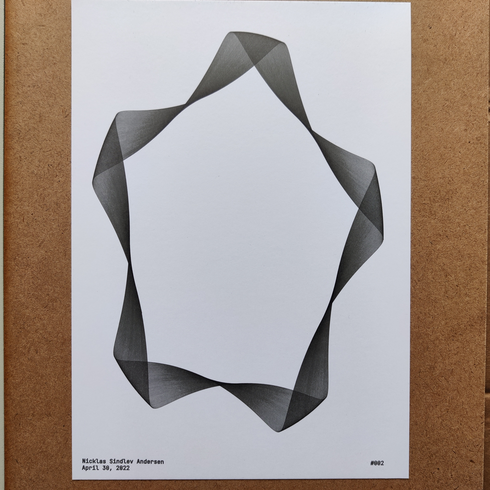

# Sketch002

Sketch002v1                                          |  Sketch002v2                                        |  Sketch002v3                                       |
:---------------------------------------------------:|:---------------------------------------------------:|:--------------------------------------------------:|
  |  | |

Sketch002v4                                          |
:---------------------------------------------------:|
  |

#### Short Description

Roulette curves (specifically Epitrochoid and Hypotrochoid curves) whose x and y coordinates have been scaled appropriately to fit the format.

#### Sketch Details

The different versions of the sketch were generated with the following general attributes: 

Sketch Version | Attribute   | Value                                |
:-------------:|:-----------:|:------------------------------------:|
Sketch002v1-v3 | Format      | A4                                   |
-              | Line width  | 0.2mm                                |
Sketch002v4    | Format      | A4                                   |
-              | Line width  | 0.1mm                                |

## Penplotter Output

Sketch002v1                                          |  Sketch002v2                                        |  Sketch002v3                                       |
:---------------------------------------------------:|:---------------------------------------------------:|:--------------------------------------------------:|
  |  | |

Sketch002v4                                          |
:---------------------------------------------------:|
  |

#### Drawing Utensils

 

Sketch Version | Type        | Value                                |
:-------------:|:-----------:|:------------------------------------:|
Sketch002v1-v3 | Paper       | Daler & Rowney, A4, bristol board    |
-              | Pen         | Staedtler, 0.1mm, fineliner          |
Sketch002v4    | Paper       | Daler & Rowney, A4, bristol board    |
-              | Pen         | Staedtler, 0.05mm, fineliner         |

!!! note
    Take note that the line density in Sketch002v4 is high. 
    
    To get better results there should be more space between the lines or an even smaller fineliner should be used.