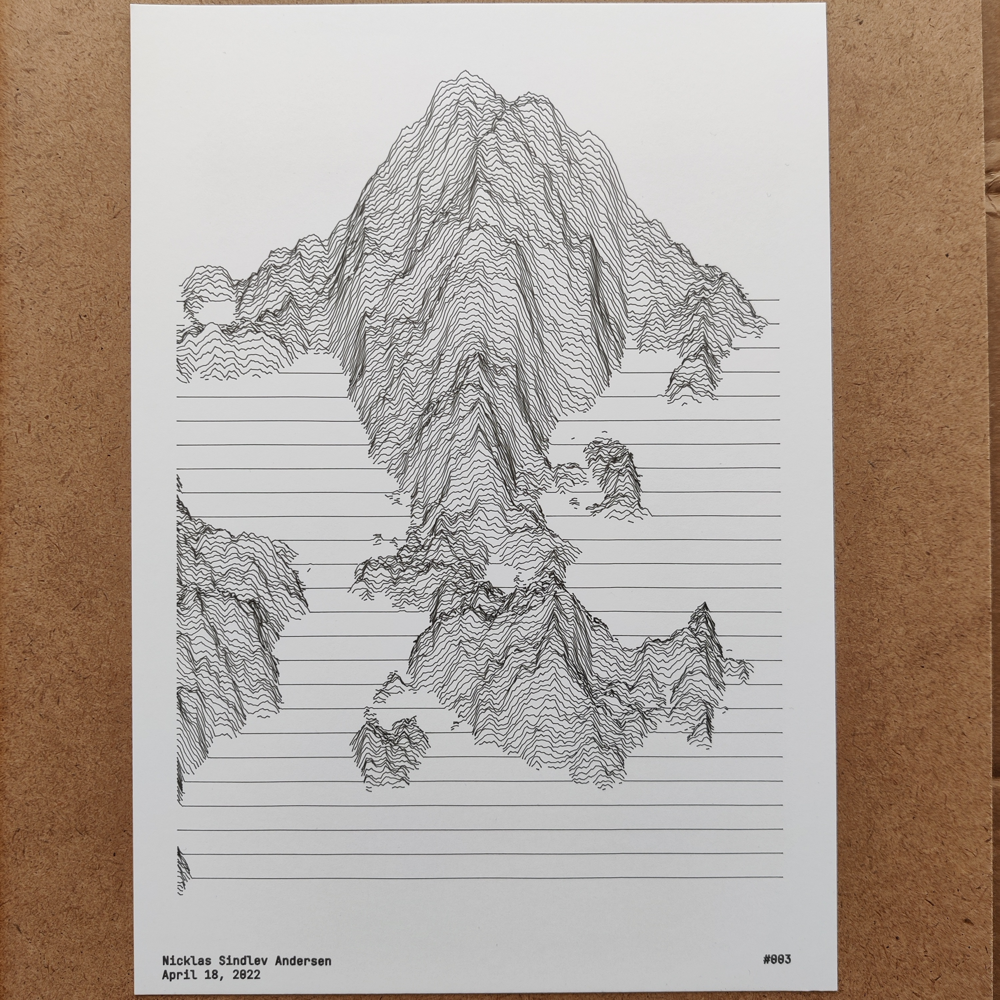
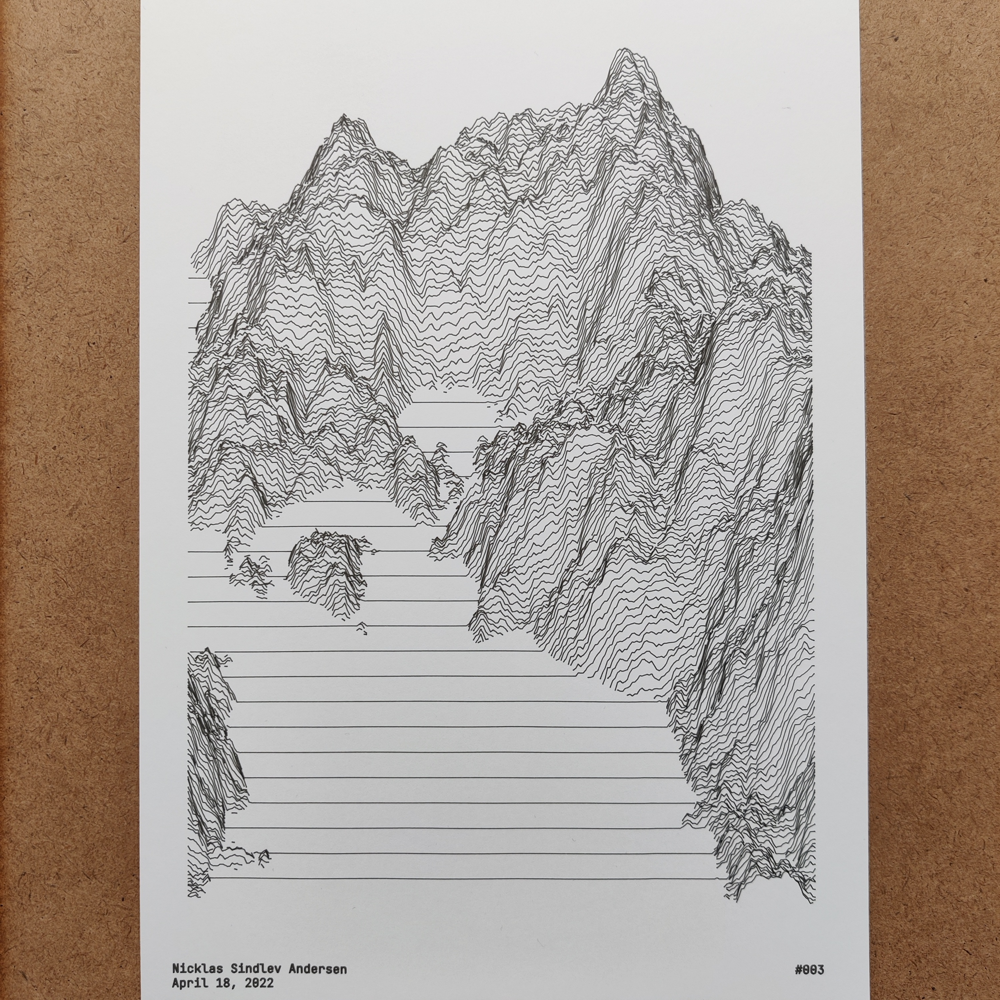
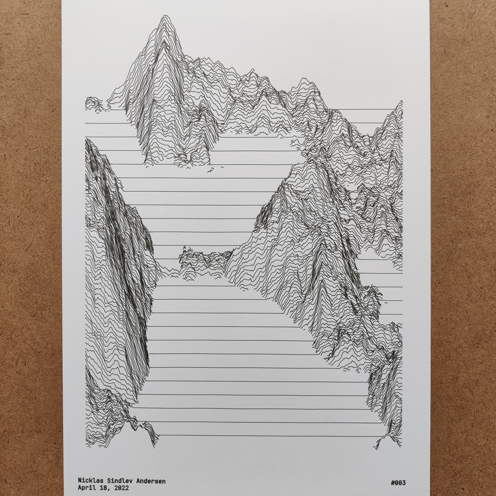
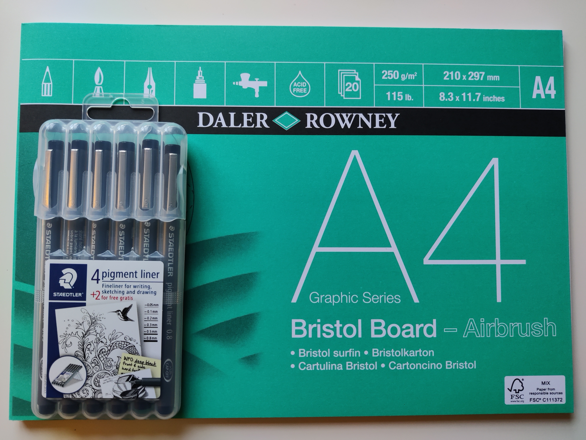

# Sketch003

Sketch003v1                                          |  Sketch003v2                                        |  Sketch003v3                                       |
:---------------------------------------------------:|:---------------------------------------------------:|:--------------------------------------------------:|
  |  | |

#### Short Description

Line-based fractal landscapes whose x and y coordinates have been scaled appropriately to fit the format.

#### Sketch Details

The different versions of the sketch were generated with the following general attributes: 

Sketch Version | Attribute   | Value                                |
:-------------:|:-----------:|:------------------------------------:|
Sketch003v1-v3 | Format      | A4                                   |
-              | Line width  | 0.2mm                                |

## Penplotter Output

Sketch003v1                                          |  Sketch003v2                                        |  Sketch003v3                                       |
:---------------------------------------------------:|:---------------------------------------------------:|:--------------------------------------------------:|
  |  | |

#### Drawing Utensils

 

Sketch Version | Type        | Value                                |
:-------------:|:-----------:|:------------------------------------:|
Sketch003v1-v3 | Paper       | Daler & Rowney, A4, bristol board    |
-               | Pen         | Staedtler, 0.05mm, fineliner        |

